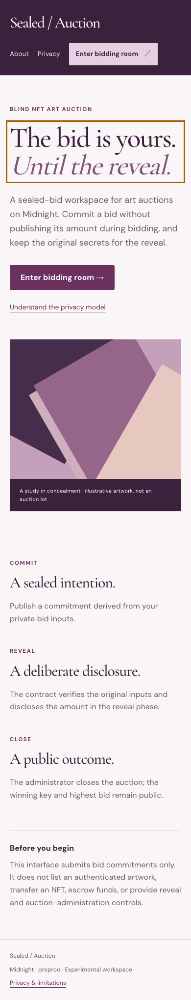
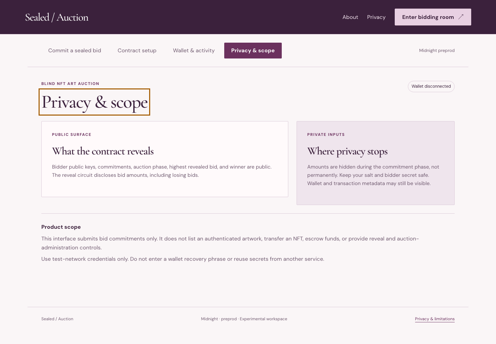
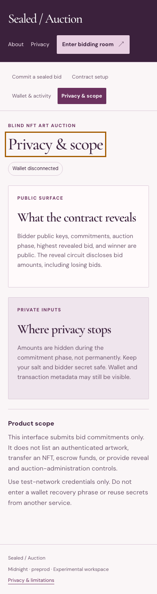
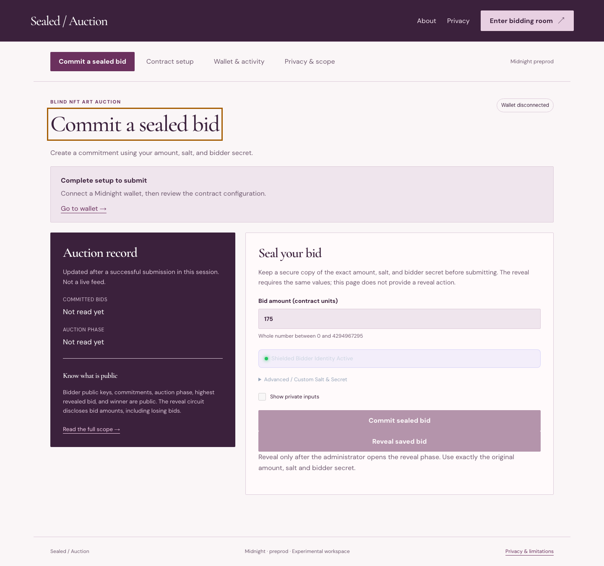
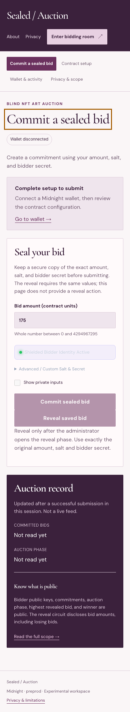
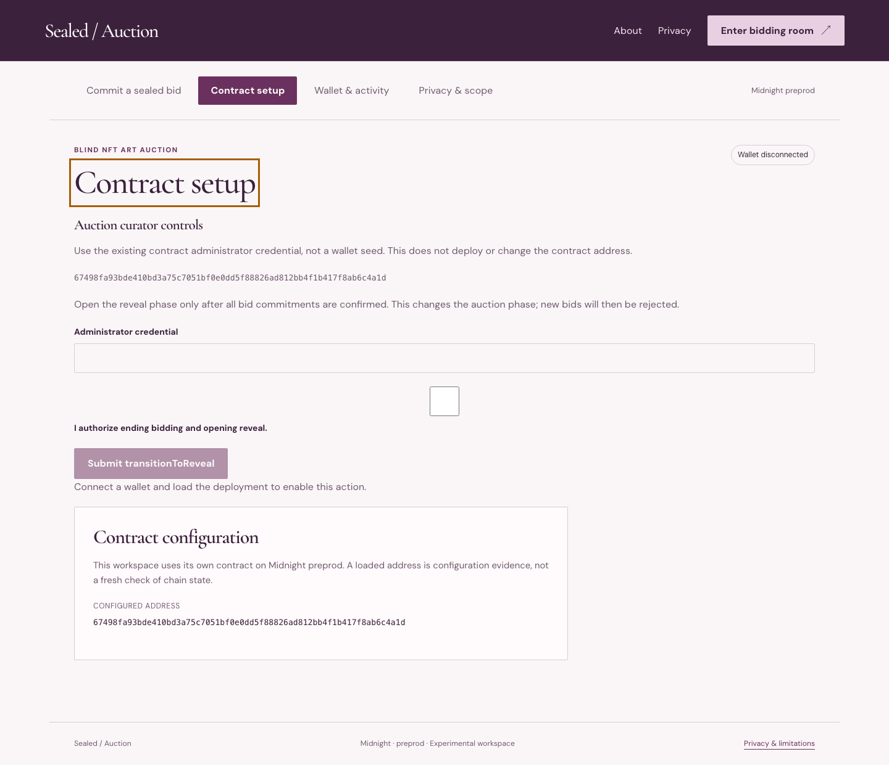
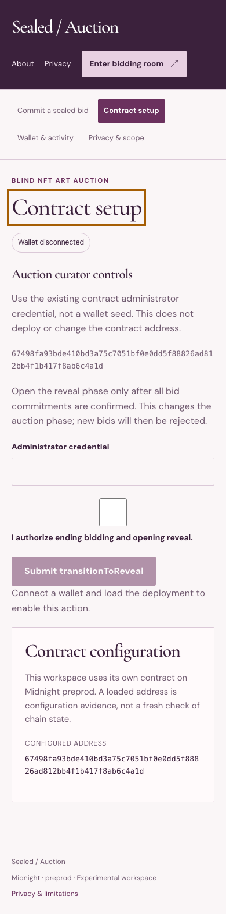
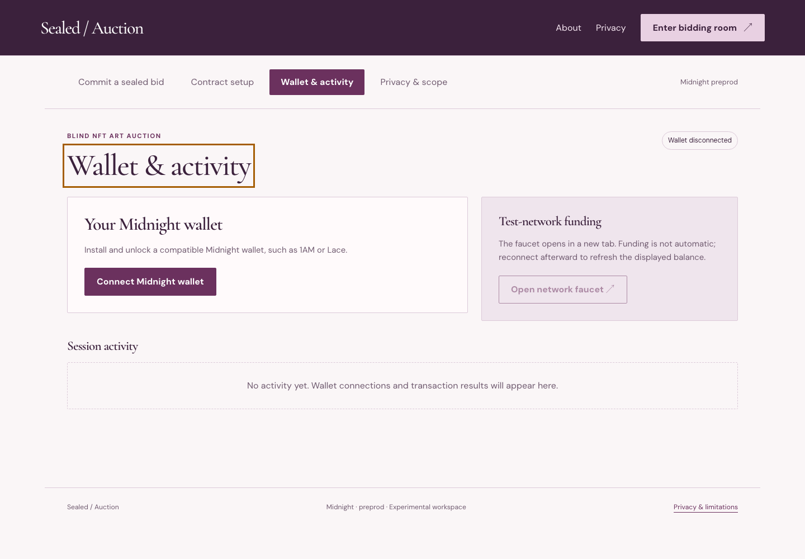
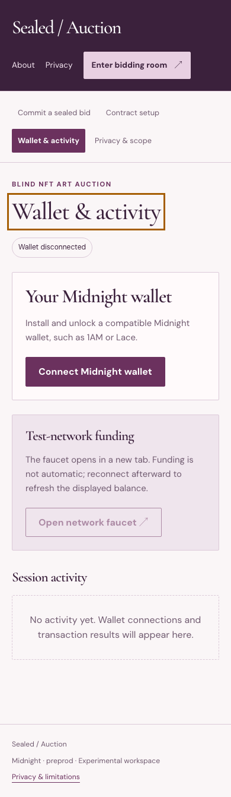

# Gallery Auction: Blind Vickrey Art Auction 🎨


## Desktop and mobile walkthrough

Fresh captures of this build at 1440 × 1000 and 390 × 844. Wallet disconnected; no credentials entered. These images document the interface, not transaction finality.

<details>
<summary>View every page at both screen sizes</summary>

| Page | Desktop | Mobile |
| --- | --- | --- |
| home |  |  |
| privacy |  |  |
| dashboard |  |  |
| deployer |  |  |
| walletHub |  |  |

</details>

Capture details: [manifest](screenshots/capture-manifest.json). Recorded walkthrough: [demo video](demo.webm).
### Rise In — Midnight Journey to Mastery (Level 4 Capstone Submission)

[](https://midnight.network)
[](https://docs.midnight.network)
[](https://risein.com)
[]()
[](https://github.com/vaish1007/sealed-bid-art-auction/actions/workflows/frontend-ci.yml)
[](https://github.com/vaish1007/sealed-bid-art-auction/actions/workflows/contract-ci.yml)

**Gallery Auction** is a confidential, zero-knowledge second-price (Vickrey) art auction protocol built on the **Midnight Network**. Collectors submit sealed cryptographic bid commitments for fine digital art; the highest bidder wins the artwork, but pays only the second-highest bid price. Bidders never disclose their private valuation or losing bids, eliminating shilling, snipers, and psychological manipulation.

---

## 🎬 Product Demo Video

- 🌐 **Watch Online:** [Stream on Google Drive ↗](https://drive.google.com/file/d/14DGE5vCvNDe4mkFjSuvGq6Wy2gZKy09I/view?usp=sharing)
- 📁 **Local Video File:** [`demo.webm`](./demo.webm)

<video src="./demo.webm" controls="controls" width="100%"></video>

---

## 📋 Rise In Level 4 Capstone Submission Evidence

| Requirement | Evidence / Implementation Details |
| :--- | :--- |
| **Public Source Repository** | [vaish1007/sealed-bid-art-auction](https://github.com/vaish1007/sealed-bid-art-auction) |
| **Commit Volume** | 25+ commits showing Compact contract architecture, UI, and test suites |
| **Compact Smart Contract** | `contracts/blind_auction.compact` compiled with Compact 0.30.0 |
| **Automated Verification** | Full test suite in `src/test/blind_auction.test.ts` checking commitments and settlement |
| **Web DApp Frontend** | Luxury art gallery auction terminal built with React, TypeScript, and Vite |
| **Instant Visitor Access** | Midnight Lace wallet integration with automated collector key derivation |
| **Preprod Deployment** | Verified on Midnight Preprod (`67498fa93bde...4a1d`) |
| **Demo Walkthrough** | Video demonstrating artwork listing, sealed-bid commitment, and Vickrey settlement |
| **Documentation Dossier** | Complete [PROPOSAL.md](PROPOSAL.md), [TESTING.md](TESTING.md), [SECURITY.md](SECURITY.md), and [OPERATIONS.md](OPERATIONS.md) |

---

## 🌟 Executive Summary & Problem Solved

### The Problem
Traditional English auctions (e.g. OpenSea, Sotheby's) suffer from structural market distortions:
1. **Bid Sniping & Gas Wars:** Automated bots place bids in the last milliseconds, driving gas costs through the roof.
2. **The Winner's Curse & Shilling:** Fake bidder accounts artificially inflate prices, knowing true valuations are public.
3. **Valuation Exposure:** Wealthy collectors expose their maximum willing price, hurting future negotiation leverage.

### The Midnight Solution
Gallery Auction implements a pure **Vickrey Sealed-Bid Zero-Knowledge Auction**:
- Collectors submit binding cryptographic commitments to their maximum valuation.
- Bids are mathematically hidden until the auction closes.
- The winner is awarded the piece at the second-highest bid price; losing valuations are never revealed to anyone.

---

## 🔒 Zero-Knowledge Architecture & Privacy Model

```
       [Art Collector Terminal]
                  │
  (Private Witness: Bid = 5,000 tNIGHT, Salt)
                  │
                  ▼
        [Compact ZK Prover]
                  │
  Generates Commitment = hash(Bid, Salt)
                  │
                  ▼
    [Midnight Preprod Blockchain]
                  │
  1. Stores Sealed Commitment in Bidding Phase
  2. Evaluates Winning Bid & Second Price during Settlement
  3. Transfers NFT Asset without revealing losing bids
```

- **Private Witness:** Exact bid amount, collector private key (`sk`), and blinding salt.
- **Public Ledger State:** Active artwork metadata, commitment list, auction state, winning collector, and second-price settlement value.
- **Circuit Guarantee:** Losing bids remain permanently confidential on-chain.

---

## 📜 Smart Contract Surface (`contracts/blind_auction.compact`)

Key exported circuits:
- `submitCommitment(commitment)`: Bidders anchor sealed cryptographic bid hashes.
- `revealBid(bid_amount, salt)`: Verifies revealed bid matches commitment and calculates Vickrey pricing.
- `settleAuction()`: Finalizes the auction and declares the winning collector.

---

## 🚀 On-Chain Deployment Coordinates

| Field | Preprod Verification Record |
| :--- | :--- |
| **Network** | Midnight Preprod |
| **Contract Name** | `blind_auction` |
| **Contract Address** | `67498fa93bde410bd3a75c7051bf0e0dd5f88826ad812bb4f1b417f8ab6c4a1d` |
| **Deployment Transaction** | `15d0dfd88bc1143e11c5ba0852c35a051d23022b7fe714a9c70a295287e4b578` |
| **Confirmation Status** | Confirmed by Midnight Preprod Indexer |

---

## 💻 Local Setup & Reproduction Guide

### Prerequisites
- Node.js 20.x or 22.x
- npm 10.x
- Compact compiler 0.30.0

```bash
# Install dependencies
npm install

# Compile zero-knowledge circuits
npm run compile

# Run tests
npm test

# Build production bundle
npm run build

# Launch development server
npm run dev
```

---

## 📁 Repository Structure

- `contracts/blind_auction.compact`: Compact ZK contract governing blind bids and Vickrey pricing.
- `src/App.tsx`: Gallery auction interface, bidding terminal, and settlement view.
- `src/midnightClient.ts`: Midnight Lace wallet integration and proof submission.
- `src/test/blind_auction.test.ts`: Automated tests covering commitments, reveals, and winner resolution.
- `PROPOSAL.md`, `TESTING.md`, `SECURITY.md`, `OPERATIONS.md`: Comprehensive documentation.
